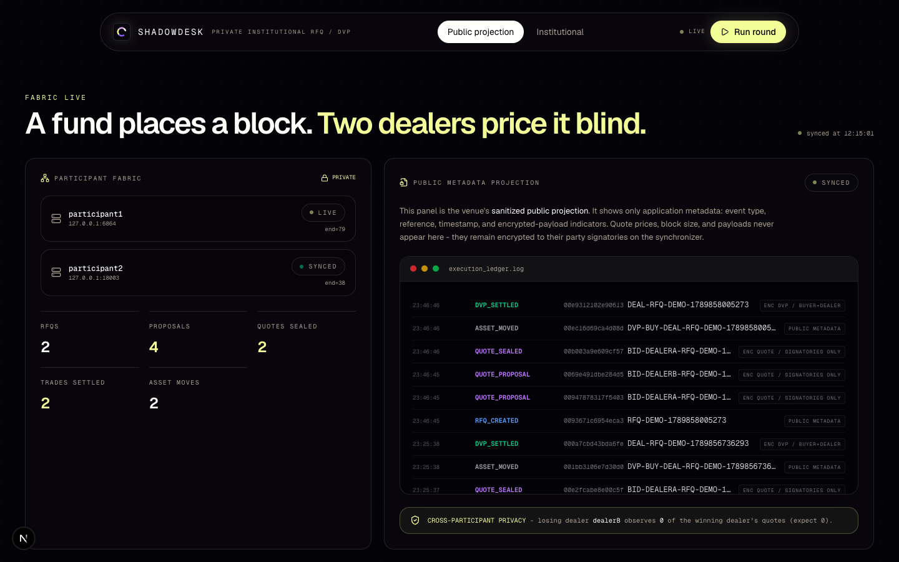
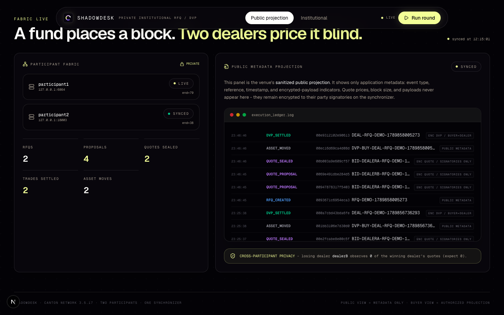
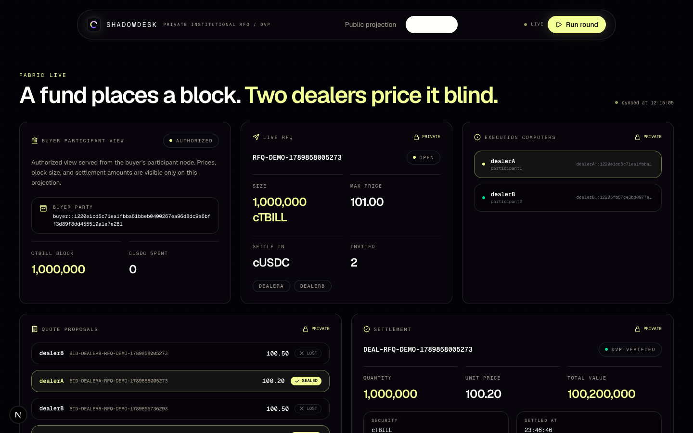
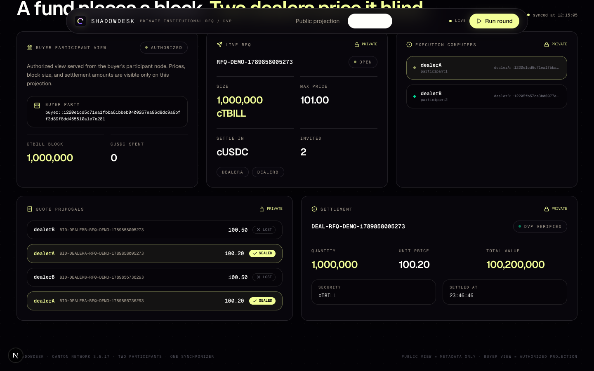
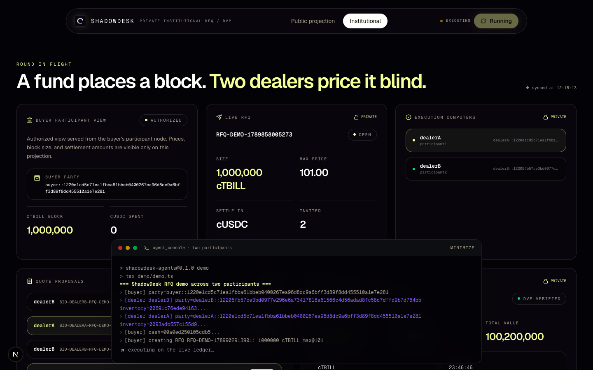
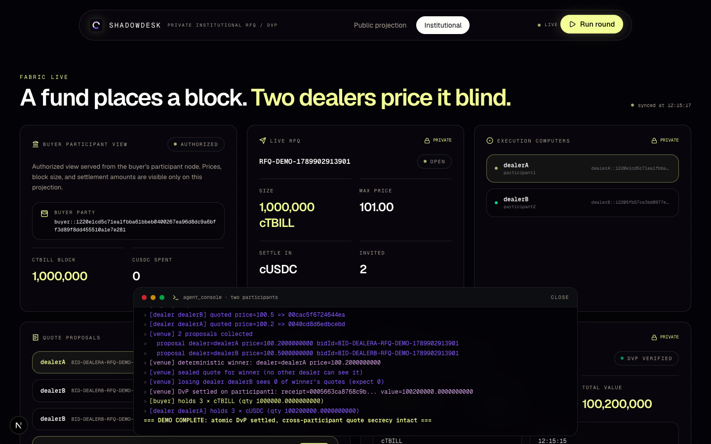
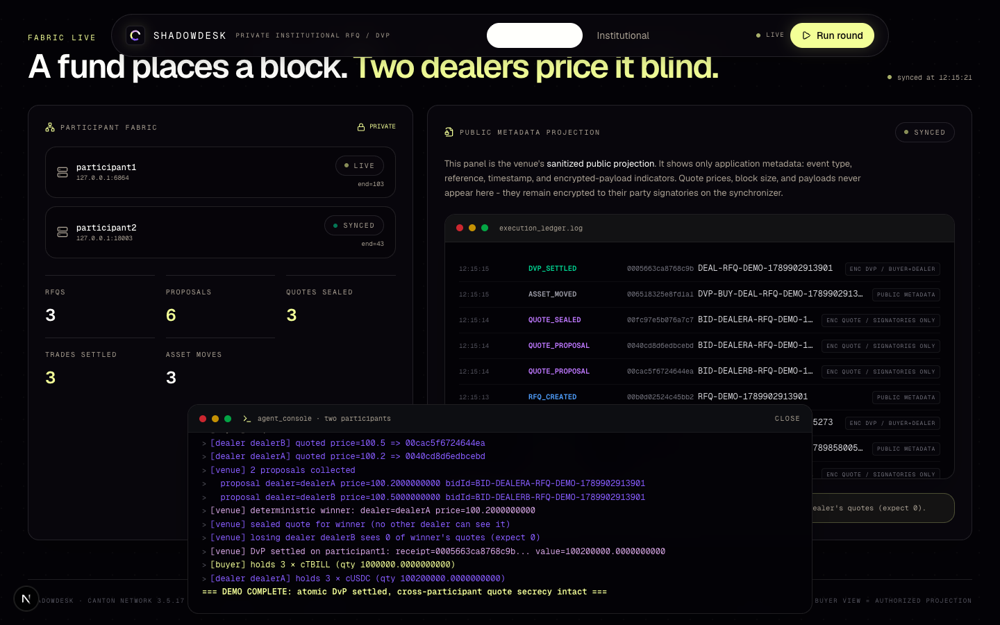

# ShadowDesk
License: MIT Policy-Controlled Treasury Execution on Canton

Approve. Quote. Award. Settle.

ShadowDesk is a policy-controlled treasury execution layer on the Canton Network. It binds agent discretion to an approved mandate, prices a block trade through private sealed RFQs, and settles the winning trade against real token holdings atomically.

The single workflow connects the two layers: the Daml contracts bound what an agent may trade, and the Canton Token Standard registry settles the awarded trade.

Live dashboard: https://shadowdesk-inky.vercel.app · Live dashboard (institutional): https://shadowdesk-inky.vercel.app/dashboard · LocalNet: http://localhost:3001 · Canton DevNet (HackCanton-01 participant).

Quickstart · Screenshots · The One Rule · What ShadowDesk Does · Architecture · How ShadowDesk Uses Canton · Honesty Table · Run It Locally · The One-Flow Demo · Configuration · Deploy

This project was built for the Canton Network track of HackCanton Season 3. It is a proof of concept, not a production service.

Nothing here is financial advice, an investment product, or a custodial service. DevNet settlement uses fauceted test tokens (CBTC, BETH) minted by the BitSafe faucet, and LocalNet runs synthetic assets. No real money moves.

Table of Contents
Quickstart
Screenshots
The One Rule
What ShadowDesk Does
Architecture
Component by Component
Safety, Enforced in Code
How ShadowDesk Uses Canton
Engineering Decisions and the Hard Problems
What Is Real vs Pending - The Honesty Table
Validation
Run It Locally
The One-Flow Demo
Configuration
Deploy
Project Layout
Tech Stack, Credits, Roadmap
Disclaimer and License

## Quickstart

To see the whole workflow in one command, bootstrap a clean LocalNet (ledger, package, four parties, and the agent round) and open the dashboard.

Terminal one:

```
./scripts/localnet/run-all.sh
```

Terminal two, if the dashboard did not start:

```
cd frontend
cp .env.localnet .env.local   # LocalNet parties and ports
npm install
npm run dev                   # dashboard on http://localhost:3001
```

Open http://localhost:3001. The dashboard renders the ledger state directly. A demo round runs during bootstrap, so the projections, the settlement receipt, and the registry legs are already populated.

To run a real DevNet round instead, set `SHADOWDESK_NETWORK=devnet`, configure the DevNet parties in `frontend/.env.local`, fund them once with `npm run faucet:fund`, then press **Run round** in the dashboard.

## Screenshots

The dashboard empty state:



Public culture view of the run:



Public privacy banner after the round:


The institutional buyer view:



The settlement view with receipt and registry legs:



The console streaming agent output mid-round:



The console after a completed round:



The public view after the round completed:



Full recorded walkthrough:

[Demo walkthrough video](./docs/demo-walkthrough/demo-walkthrough.mp4)

## The One Rule

Never claim a trade the ledger did not actually settle.

ShadowDesk's whole point is that execution is closed with real ledger and registry evidence, so every claim in its UI is grounded in a recorded transaction.

The rule is enforced in three layers.

First, settlement claims. A `SettlementReceipt` is only shown as settled when it is the response of a live `Deal.Settle` call and both registry `Allocation_ExecuteTransfer` legs committed in the same `submitMany` transaction. The receipt cannot exist unless the tokens moved, and the tokens cannot move unless the receipt was written (`agents/shared/real-dvp.ts`).

Second, award claims. The winning quote is the quote the seal actually referenced. The rank and the saving are re-derived from the recorded bid set, never from a hardcoded number. A claim that the cheaper bid won is verified from the ledger, and the dashboard re-derives it from ledger data alone.

Third, privacy claims. A quote is only "private" when the Daml contract's stakeholder set says so - the `QuoteProposal` is signatory to a single dealer and observed by the buyer. The losing dealer's `all()` over the winner's quotes returns empty, and that assertion is part of the scenario suite and an e2e check (`daml/src/ShadowDesk/Test.daml`, `agents/e2e/real-flow-check.ts`).

## What ShadowDesk Does

Mandate approval
A buyer and a risk officer approve a `TreasuryMandate` that fixes the dealers, the assets, the amount, the maximum price, and the expiry. Approval is a ledger event with both parties as signatories.

Private RFQ
The buyer agent opens a `BlockTradeRFQ` from the approved mandate. `OpenRfq` is the mandate's real control point: the ledger refuses any request that exceeds the cap amount or price. The agent cannot open more than the mandate allows.

Sealed quoting
Each dealer agent submits one `QuoteProposal`, signatory to that dealer alone and observed only by the buyer. A competing dealer never sees another dealer's price - that is a Daml stakeholder property, not a UI filter.

Deterministic award
The buyer agent ranks the proposals with the `LowestPriceThenBidId` policy and seals the winning quote. Sealing consumes the RFQ, so a request yields at most one award, and the sealed quote records the mandate link, the winning bid id, and the rule it was awarded under.

Atomic settlement
Both counterparties authorize the `Deal` against the sealed quote, then `Settle` executes delivery-versus-payment. On DevNet that is one ledger update: `Deal.Settle` and both registry `Allocation_ExecuteTransfer` commands commit in a single `submitMany` transaction.

Verified, then remembered
The dashboard rebuilds state from ledger and registry queries, and the durable worker reruns real DevNet rounds on demand. Run history and receipts are queryable, not scrubbed.

## Architecture

Two decisions drive this architecture.

The first is that policy lives in the Daml contracts, not in the agents. Cap enforcement (`OpenRfq`), award determinism (`LowestPriceThenBidId`), and atomic settlement (`Deal.Settle`) are ledger behavior, so no agent can exceed, re-award, or partially settle on its own.

The second is that settlement spans two packages in one update. The ShadowDesk receipt and the registry legs commit atomically, so the receipt is proof the tokens moved and the tokens only move with a receipt.

Phase | What happens | Where
--- | --- | ---
Approve | Buyer + risk officer approve a `TreasuryMandate` (dealers, assets, amount, max price, expiry). | `daml/src/ShadowDesk/Asset.daml`
Open | Buyer opens a `BlockTradeRFQ`; `OpenRfq` refuses anything past the cap. | `daml/src/ShadowDesk/Rfq.daml`
Quote | Dealers submit sealed `QuoteProposal`s, signatory to one dealer, observed by the buyer. | `daml/src/ShadowDesk/Rfq.daml`, `agents/dealer/dealer.ts`
Award | Buyer runs `LowestPriceThenBidId` and seals; sealing consumes the RFQ. | `daml/src/ShadowDesk/Rfq.daml`, `agents/buyer/buyer.ts`
Settle | `Deal.Settle` + both registry legs in one `submitMany`. | `daml/src/ShadowDesk/Settlement.daml`, `agents/shared/real-dvp.ts`
Verify | Dashboard re-derives state from ledger + registry; losing-dealer zero-view is asserted. | `frontend/app/api/state`, `agents/e2e/real-flow-check.ts`

## Component by Component

Layer | Module | Responsibility
--- | --- | ---
Contracts | `daml/src/ShadowDesk/Asset.daml` | `TreasuryMandate` and mandate lifecycle (approve, enforce caps).
Contracts | `daml/src/ShadowDesk/Rfq.daml` | `OpenRfq`, `QuoteProposal`, `LowestPriceThenBidId`, seal - the RFQ lifecycle.
Contracts | `daml/src/ShadowDesk/Settlement.daml` | `Deal`, `Settle`, `SettlementReceipt` - atomic DvP.
Contracts | `daml/src/ShadowDesk/Test.daml` | The ten scenario suite: policy lifecycle, private RFQ, cap override, authz + replay, quote validation, atomic DvP, invalid leaves, multi-participant privacy, deal-must-match-award, at-most-once award.
Agent | `agents/shared/client.ts` | JSON Ledger API v2 client, `submitMany`, party-authenticated calls.
Agent | `agents/shared/config.ts` | Network, parties, instruments, caps from environment.
Agent | `agents/buyer/buyer.ts` | Opens RFQs, ranks sealed quotes, seals, drives settlement.
Agent | `agents/dealer/dealer.ts` | Submits `QuoteProposal`s.
Agent | `agents/shared/settlement.ts` | V1 settlement against registry allocations.
Agent | `agents/shared/real-dvp.ts` | Atomic `Deal.Settle` + registry legs in one `submitMany`.
Agent | `agents/shared/settlement-v2.ts`, `agents/e2e/real-dvp-v2.ts`, `agents/e2e/v2-settlement-check.ts` | V2 registry-native receipt, validated locally.
Agent | `agents/e2e/real-guard-check.ts` | Rejection-path checks (cap, privacy, atomicity) against a live ledger.
Agent | `agents/e2e/real-flow-check.ts` | Full happy-path round incl. losing-dealer zero-view assertion.
Agent | `agents/e2e/faucet-fund.ts` | Mints fauceted CBTC/BETH for the settlement parties.
Agent | `agents/e2e/prune-stale.ts` | Cleans stale archived/expired contracts between rounds.
Worker | `worker/server.mjs` | Durable on-demand runner on the VPS; spawns agent runs, persists run state.
Frontend | `frontend/app/api/state` | Dashboard projection rebuilt live from ledger + registry.
Frontend | `frontend/app/api/replay` | Proxies **Run round** to the worker and streams agent output.
Frontend | `frontend/app/api/auth` | OIDC (Keycloak) login for the DevNet participant.
Frontend | `frontend/lib/state.ts` | Ledger + registry projection model.
Frontend | `frontend/lib/canton.ts` | Canton Ledger API queries from the dashboard.
Frontend | `frontend/lib/session-cookie.ts` | Signed session cookie for replay authorization.

## Safety, Enforced in Code

Claim | How it is enforced
--- | ---
Mandates cap what an agent may trade | `OpenRfq` rejects any RFQ past the mandate amount or max price; covered by `runMaxPriceCannotBeOverridden` and asserted live by `e2e:real-guard`.
Quotes stay private | `QuoteProposal` is signatory to one dealer, observed by the buyer; a rival dealer's `all()` returns empty.
One RFQ, at most one award | Sealing consumes the RFQ; `runRfqIsAwardedAtMostOnce`.
Award matches the deal | Deal authorization requires the sealed quote; `runDealMustMatchAward`.
Settlement is atomic | Receipt + both registry legs in one `submitMany`; `runAtomicDvPSettlement`, `runDvPRejectsInvalidLeaves`, asserted live on DevNet by `e2e:real-flow`.
Secrets stay server-side | Canton tokens, session files, and the worker secret are read from the environment and never sent to the client.

## How ShadowDesk Uses Canton

Writes (via the JSON Ledger API v2, `agents/shared/client.ts`):
- Mandate approval with buyer + risk officer signatories.
- `OpenRfq` from the approved mandate.
- Dealer `QuoteProposal`s.
- Seal / award under `LowestPriceThenBidId`.
- `Deal.Settle` plus two registry `Allocation_ExecuteTransfer` legs as one `submitMany`.

Reads:
- Party-authenticated contract queries (buyer sees its RFQs and sealed quotes; a dealer sees only its own quotes).
- Token Standard registry state through the Digital Asset utilities endpoint (`SHADOWDESK_REGISTRY_URL`).

Contract: `shadowdesk-treasury` 1.0.0 (package id `50a21ee1…` on Daml SDK 3.5.10), deployed to the HackCanton DevNet participant and to the LocalNet sandbox.

There is no custody at the app layer. The agent only submits transactions as its party; it never holds keys for anyone else. On DevNet the settlement tokens (CBTC, BETH) come from the BitSafe faucet, which mints them for the configured settlement parties. The utility registry tracks the allocations; the ledger holds the authored contracts.

## Engineering Decisions and the Hard Problems

Privacy is a protocol primitive, not an app layer.
On a public chain, a "private" RFQ usually means the app hides data that the platform still sees. On Canton, visibility is decided by Daml stakeholders, so a dealer's quote literally does not exist for a rival dealer. That claim is asserted in `runMultiParticipantPrivacyAndSettlement` and in the live e2e check, which prints the losing dealer's empty view.

Policy in the contract, not the agent.
If the cap lived in the agent, a buggy or malicious agent could trade more than approved. `OpenRfq` and `Deal` enforce the mandate and the award in the ledger, so the ceiling holds even when the agent is wrong.

One atomic update spans two packages.
The most fraudulent settlement would have the receipt exist while the tokens did not move. By committing `Deal.Settle` and both registry legs as one `submitMany`, the receipt is unilaterally tied to the transfers. If any leg fails, all fail.

Deterministic award beats discretion.
`LowestPriceThenBidId` removes the "best execution" argument from the agent. The seal records the rule, the mandate link, and the winning bid, so an award is auditable as a ledger fact rather than as an agent's opinion. Best execution is evidenced, not (yet) enforced - the buyer could in principle seal a worse bid, and the runner asserts the recorded ranking instead.

The environments are honest about their split.
LocalNet runs two participants, so `runMultiParticipantPrivacyAndSettlement` and the live privacy assertion run on a real participant boundary - but with synthetic assets. The DevNet run settles real fauceted CBTC and BETH, but against a single participant, so the same round does not cross the participant boundary. Both claims are made where the evidence is.

## What Is Real vs Pending - The Honesty Table

Capability | Status
--- | ---
Mandate lifecycle (approve, caps, expiry) | Real - scenario suite + live DevNet/LocalNet rounds.
Cap enforcement on `OpenRfq` | Real - `runMaxPriceCannotBeOverridden` + `e2e:real-guard` rejects an over-cap RFQ.
Private sealed quotes | Real - `QuoteProposal` signatory to one dealer; rival `all()` empty.
Deterministic award | Real - `LowestPriceThenBidId`, seal consumes the RFQ.
Atomic DvP in one update | Real - DevNet 2026-10-08: `Deal.Settle` + both registry legs in one `submitMany`, receipt hash recorded.
Cross-participant privacy proof | LocalNet only - two participants on LocalNet; the DevNet run uses one participant, so the privacy assertion runs against the LocalNet boundary.
V2 registry-native receipt | LocalNet only - compiles and validates locally, but upload to the DevNet participant returns 403 (uploads need operator credentials), so DevNet settles via the V1 path.
Best-execution enforced on-ledger | Not enforced - recorded and evidenced from the bid set; the runner asserts the ranking, the ledger does not force it.
Third dealer / RFQ amendment / cumulative mandate spend | Roadmap - documented as next steps, not shipped.
Mainnet / real funds | Not done - DevNet faucet tokens and synthetic LocalNet assets only.

The most honest limit is environment topology. Privacy across a participant boundary is proven on LocalNet; settlement on real registry tokens is proven on DevNet; no single run currently demonstrates both at once.

## Validation

Check | Command | Covers
--- | --- | ---
Daml scenario suite | `dpm test` (in `daml/`) | The ten scenarios + `noop` on a clean sandbox.
Agent typecheck | `npm run typecheck` (in `agents/`) | TypeScript across buyer, dealer, shared, e2e, demo.
Agent live guard checks | `npm run e2e:real-guard` | Rejection paths against a running local ledger.
Agent live happy path | `npm run e2e:real-flow` | Full round incl. losing-dealer privacy assertion.
Award chain | `npm run e2e:award-chain` | Deal necessarily follows the sealed award.
DevNet funds | `npm run faucet:fund` | Mints fauceted CBTC/BETH for the settlement parties.
Frontend typecheck | `npm run typecheck` (in `frontend/`) | Next.js + React types.
Frontend build | `npm run build` (in `frontend/`) | Production Next.js build.
Frontend unit tests | `npm test` (in `frontend/`) | Registry projection + session cookie.
LocalNet smoke | `./scripts/localnet/run-all.sh` | Sandbox, package deploy, four parties, agent round, dashboard.

There is no unit-test suite in the Daml style beyond the scenario suite; the commands above are the executable validation shipped with the repo.

## Run It Locally

1. Prerequisites

Node.js 20+, the `dpm` CLI, and the Daml SDK 3.5.10. On macOS, ensure `~/.dpm/bin` is on `PATH` (`./scripts/verify.sh` checks the toolchain).

2. LocalNet (the whole round in one command)

```
./scripts/localnet/run-all.sh
```

This boots a clean sandbox, deploys `shadowdesk-treasury`, provisions the two LocalNet participants, runs the agent round against synthetic assets, and serves the dashboard on http://localhost:3001.

3. Manual LocalNet

```
./scripts/localnet/start-ledger.sh
cp frontend/.env.localnet frontend/.env.local
cd agents && npm install
npm run e2e:real-guard   # rejection paths
npm run e2e:real-flow    # full round
cd ../frontend && npm install && npm run dev
```

4. DevNet

```
cp frontend/.env.devnet frontend/.env.local
```

Fill in the party IDs (buyer, risk officer, dealer A, dealer B - create them in the NODERS console when on DevNet) and set `SHADOWDESK_NETWORK=devnet`, the participant JSON URLs, and the OIDC endpoints for the HackCanton-01 participant. Then fund and run:

```
cd agents && npm install
npm run faucet:fund      # mints fauceted CBTC/BETH for the settlement parties
npm run e2e:real-flow    # real round on DevNet
cd ../frontend && npm install && npm run dev   # dashboard on :3001
```

The DevNet participant requires OIDC access tokens; `SHADOWDESK_CANTON_ACCESS_TOKEN`, `SHADOWDESK_CANTON_REFRESH_TOKEN`, and the session store are configured in `frontend/.env.local` and never committed.

## The One-Flow Demo

Open the dashboard (`http://localhost:3001`, or press **Run round** on the live DevNet dashboard).

- The mandate is approved: buyer + risk officer commit a `TreasuryMandate` with dealers, assets, amount, max price, and expiry.
- The buyer opens a `BlockTradeRFQ`; `OpenRfq` accepts the in-cap request and would refuse an over-cap one.
- Each dealer submits one `QuoteProposal`; the buyer observes the sealed bid set.
- The buyer seals the winner under `LowestPriceThenBidId`; the RFQ is consumed.
- Both sides authorize the `Deal`; `Settle` runs `Deal.Settle` plus both registry `Allocation_ExecuteTransfer` legs in one `submitMany`.
- The dashboard projection updates: the receipt hash, the two registry legs, the rank, and the recorded saving appear - all re-derived from ledger and registry data.
- The losing dealer's view shows zero of the winning quotes (asserted in the console output).

Open the demo walkthrough video for a full recorded run: [docs/demo-walkthrough/demo-walkthrough.mp4](./docs/demo-walkthrough/demo-walkthrough.mp4).

## Configuration

Variable | Purpose
--- | ---
`SHADOWDESK_NETWORK` | `localnet` (two participants) or `devnet` (HackCanton-01 participant).
`SHADOWDESK_PARTICIPANT1_URL` / `SHADOWDESK_PARTICIPANT2_URL` | JSON Ledger API v2 endpoints for each participant.
`SHADOWDESK_BUYER_PARTY` / `SHADOWDESK_RISK_OFFICER_PARTY` / `SHADOWDESK_DEALER_A_PARTY` / `SHADOWDESK_DEALER_B_PARTY` | The four role parties.
`SHADOWDESK_ASSET_TO_BUY` / `SHADOWDESK_SETTLEMENT_ASSET` | Instrument pair (DevNet faucet mints CBTC/BETH).
`SHADOWDESK_AMOUNT` / `SHADOWDESK_MAX_PRICE` | The trade cap the mandate and RFQ accept.
`SHADOWDESK_REGISTRY_URL` | Canton Token Standard utility registry endpoint.
`SHADOWDESK_FAUCET_API_URL` | BitSafe DevNet faucet; mints CBTC/BETH for the settlement parties.
`SHADOWDESK_CANTON_ACCESS_TOKEN` / `SHADOWDESK_CANTON_REFRESH_TOKEN` / `SHADOWDESK_LEDGER_USER_ID` | DevNet OIDC credentials. Never commit.
`SHADOWDESK_OIDC_*` | Keycloak issuer, authorization, token, userinfo, logout, revocation, client id, redirect, scopes.
`SHADOWDESK_AUTH_SESSION_DIR` / `SHADOWDESK_AUTH_COOKIE_SECURE` | Signed session cookie for replay authorization.
`SHADOWDESK_WORKER_URL` / `SHADOWDESK_WORKER_SECRET` | Vercel `/api/replay` → VPS worker proxy credentials. Never commit.

Never commit `.env.local` files, Canton access tokens, session files, or the worker secret.

## Deploy

Local production build

```
cd frontend
npm run build
npm run start
```

Live dashboard (Vercel)

The repo root deploys the Next.js application from `frontend/` to Vercel (Hobby plan). The dashboard is live at https://shadowdesk-inky.vercel.app with the institutional view at `/dashboard`. `NEXT_DIST_DIR` keeps the dev and production build directories separate, so `next dev` and `next build` never corrupt each other's page manifest.

The deployed `/api/replay` route does not run rounds itself. Vercel Hobby caps a single request at 300 seconds, so the route proxies to the durable worker: it POSTs `/v1/runs` to the worker, streams the run's log lines while the request is alive, and points long runs at the worker's job-status endpoint.

Durable worker (VPS)

The worker (`worker/server.mjs`) runs on the VPS bound to `127.0.0.1:8787`, not exposed externally. It spawns the agent scripts on the real DevNet environment, holds a single-round lock, and persists run state. The dashboard's **Run round** reaches it through `SHADOWDESK_WORKER_URL` / `SHADOWDESK_WORKER_SECRET` in the Vercel environment.

To update a deployed worker: sync the agents and worker to the VPS, restart the worker service, then run a fresh round from the dashboard.

## Project Layout

```
ShadowDesk/
├─ daml/                         Daml contracts + scenario suite
│  ├─ src/ShadowDesk/            Asset (mandate), Rfq, Settlement, Test
│  └─ daml.yaml                  shadowdesk-treasury 1.0.0, SDK 3.5.10
├─ agents/                       Canton agents
│  ├─ buyer/  dealer/            Role agents (RFQ, quotes, seal, settle)
│  ├─ shared/                    client, config, faucet, settlement, real-dvp
│  ├─ e2e/                       real-flow, real-guard, award-chain, faucet-fund, prune-stale
│  ├─ demo/                      LocalNet and DevNet demo scripts
│  └─ package.json               typecheck, e2e:* commands
├─ worker/                       durable on-demand runner (server.mjs)
├─ frontend/                     Next.js dashboard
│  ├─ app/api/                   state, replay, auth (login/callback/logout/session)
│  ├─ lib/                       canton, state, registry-projection, session-cookie
│  ├─ test/                      registry projection + session cookie tests
│  └─ .env.devnet / .env.localnet / .env.example
├─ scripts/                      verify.sh, localnet/{start-ledger,run-demo,run-all,smoke-test}
└─ docs/                         architecture, business brief, pilot plan, demo-walkthrough
```

`log/` holds per-run ledger and agent transcripts. Review them before changing settlement or RFQ behavior.

## Tech Stack, Credits, Roadmap

Tech stack

Daml Smart Contracts (SDK 3.5.10) on Canton, the JSON Ledger API v2, TypeScript agents (tsx), the Canton Token Standard registry, the BitSafe DevNet faucet, Next.js 15 (App Router) with React 19, Tailwind CSS 4, `motion`, and lucide-react. Node's built-in test runner covers the frontend projection and session cookie modules.

Credits

Built on the Canton Network DevNet (HackCanton-01), with fauceted tokens from BitSafe and registry queries through the Digital Asset utilities endpoint. The Daml scenario suite and the JSON Ledger API v2 make the on-ledger guarantees checkable end to end.

Roadmap

- Deploy the V2 registry-native settlement package once DevNet uploads are enabled (today the V1 settle path runs on DevNet).
- Run a DevNet round across a real participant boundary so cross-participant privacy and real registry tokens appear in one run.
- Add a third dealer, RFQ amendment, and cumulative mandate-spend enforcement.
- Make best execution an on-ledger guarantee rather than a recorded-and-asserted ranking.

## Disclaimer and License

ShadowDesk is a hackathon proof of concept. It is not a production treasury system, a financial product, a broker-dealer service, or a custodial service, and it accepts no liability for trades placed through it or for the behavior of third-party networks it calls. DevNet settlement uses fauceted test tokens (CBTC, BETH) that move no real value; LocalNet runs synthetic assets. This repository moves no real funds.

License: MIT.