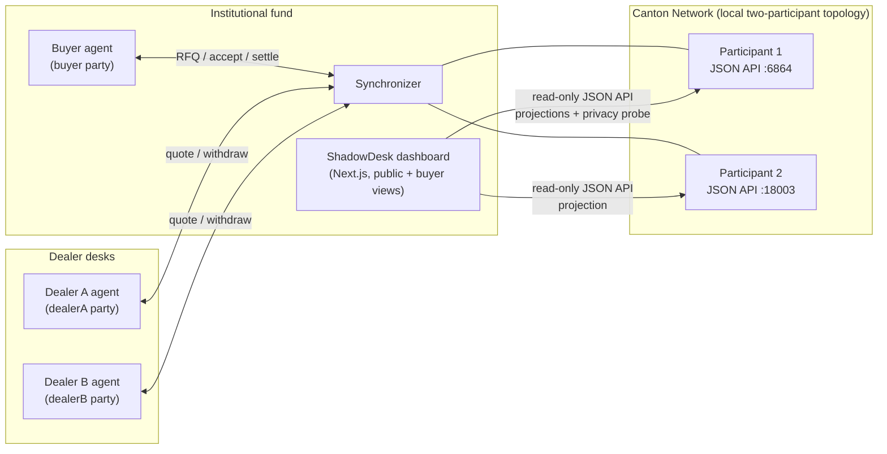
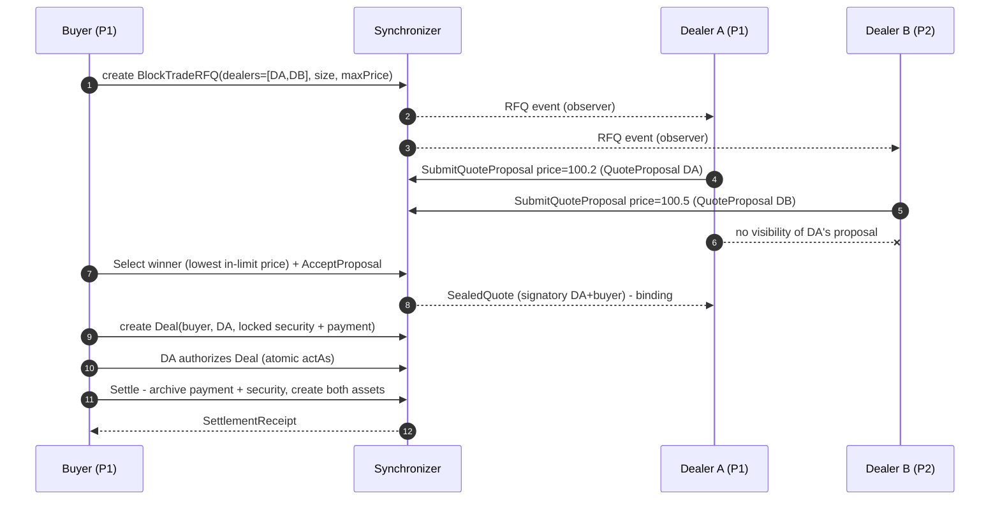
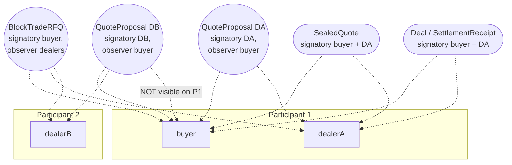

# Architecture

## System context

## Contract model

## Privacy boundaries

A dealer on participant 2 observes the RFQ it was invited to, its own quote, and nothing from the other dealer. All quote payloads and the sealed quote are encoded for the involved parties only; the dashboard's privacy banner is a live cross-participant query proving the losing dealer sees zero of the winner's quotes.

## Execution flow

| Step | Actor | Action | Contract effect |
| --- | --- | --- | --- |
| 1 | Buyer agent | Create RFQ | `BlockTradeRFQ` (signatory buyer, observers = invited dealers) |
| 2 | Each dealer agent | SubmitQuoteProposal | `QuoteProposal` (signatory dealer, observer buyer) |
| 3 | Buyer agent | Select winner | Lowest in-limit price, tie-break bid id (pure function) |
| 4 | Buyer agent | AcceptProposal | `SealedQuote` (signatory buyer + winning dealer) |
| 5 | Buyer agent | Create Deal | `Deal` (signatory buyer + winning dealer) over locked security + payment |
| 6 | Both | Settle | Atomically archives payment + security, creates buyer-held security and dealer-held payment, emits `SettlementReceipt` |

## Components

- **`daml/`** - Daml templates (`ShadowDesk.Asset`, `ShadowDesk.Rfq`, `ShadowDesk.Settlement`), the two-participant distributed runner config, and script-runner party configs.
- **`agents/`** - `shared/client.ts` (JSON Ledger API v2 client with idempotent party allocation), buyer/dealer agents, and a deterministic winner-selection module. The demo orchestrates buyer + both dealers on their own participants.
- **`frontend/`** - Next.js App Router dashboard. `/api/state` builds server-side projections from both participants; `/api/replay` streams a live agent round as newline-delimited JSON. The browser only ever talks to the dashboard API, never to a participant directly.
- **`scripts/localnet/`** - `run-demo.sh` (sandbox + DAR upload + demo), `run-all.sh` (everything, plus the dashboard).